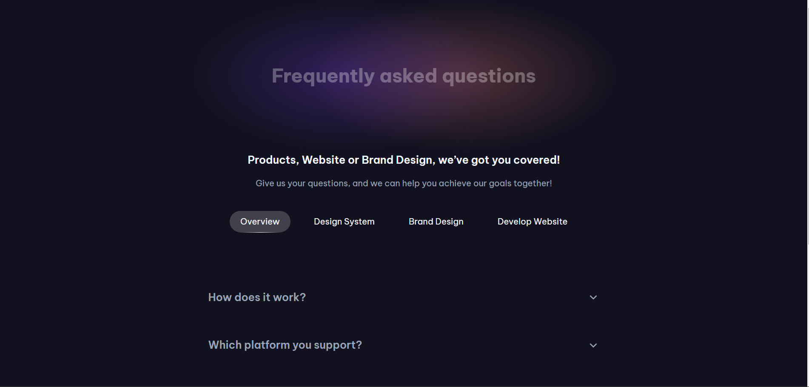

# FAQ Page

Este proyecto es una página de preguntas frecuentes interactiva y responsive, diseñada con HTML, CSS y JavaScript. Incluye una estructura acordeón para manejar el contenido de manera organizada y accesible.

## Vista Previa



Puedes ver la versión demo en vivo aquí: [FAQ Page](https://faq-page-pi.vercel.app/)

## Características

- **Cabecera**:
  - Título principal que introduce la página.
  - Subtítulos que describen el propósito del contenido.
- **Navegación**:
  - Lista de categorías con un diseño adaptativo para dispositivos móviles y de escritorio.
  - Cambia entre ítems activos para resaltar la sección seleccionada.
- **Acordeón Interactivo**:
  - Efecto acordeón para las preguntas frecuentes.
  - Cada pregunta puede ser expandida o colapsada, mostrando u ocultando la respuesta.
  - Los botones funcionan fluidamente, con íconos que rotan según el estado (expandido o colapsado).
- **Footer**: Contiene información del autor y créditos al desafío original.

## Estructura de Archivos

```
|-- index.html                 # Página principal
|-- assets/
    |-- css/
    |   |-- reset.css          # Estilos para reinicio
    |   |-- styles.css         # Estilos personalizados
    |-- js/
    |   |-- main.js            # Funcionalidad interactiva
    |-- images/
    |   |-- desktop-preview.png # Captura de pantalla
    |-- resources/
        |-- favicon.ico        # Ícono de la página
        |-- Expand_down.svg    # Íconos de los botones
```

## Instalación

1. Clona este repositorio en tu máquina local:
   ```bash
   git clone https://github.com/Ibrahim-003/FAQ-Page.git
   ```
2. Asegúrate de que tienes un navegador moderno para probar las funcionalidades de JavaScript.
3. Abre `index.html` en tu navegador para ver la página.

## Tecnologías Utilizadas

- **HTML5**: Estructura del contenido.
- **CSS3**: Estilización, incluyendo diseño responsive.
- **JavaScript**: Funcionalidades interactivas como el efecto acordeón.

## Autor

Este proyecto fue creado por [Ibrahim Almeyda](https://github.com/Ibrahim-003) como parte de un desafío en [devChallenges.io](https://www.devchallenges.io).
